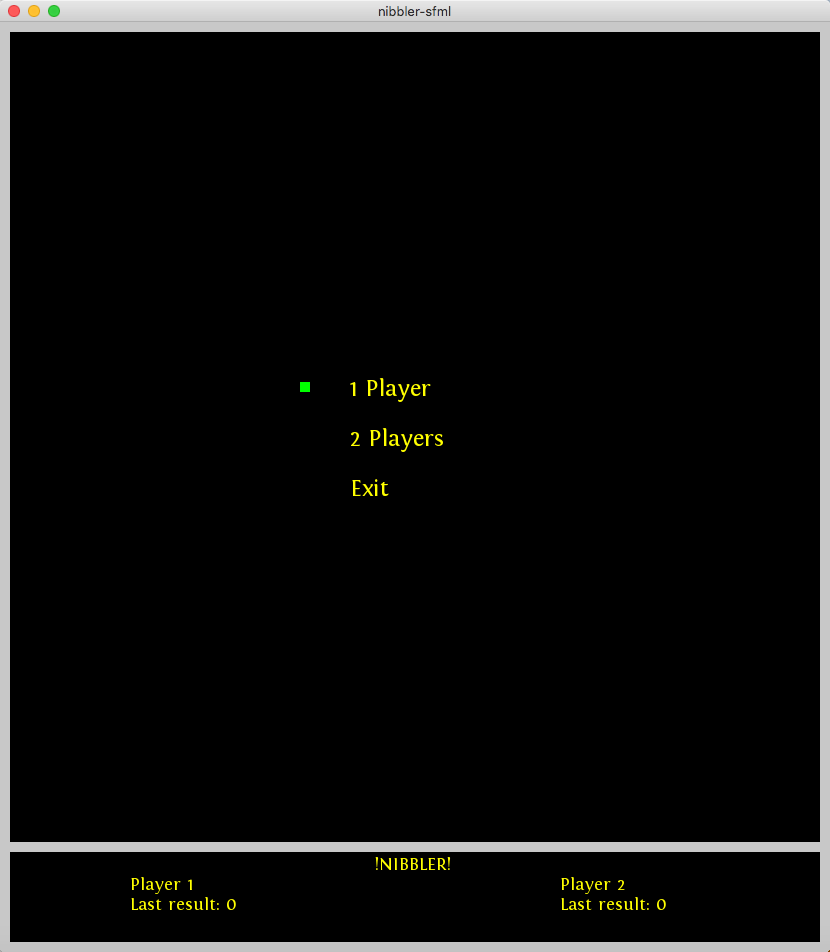
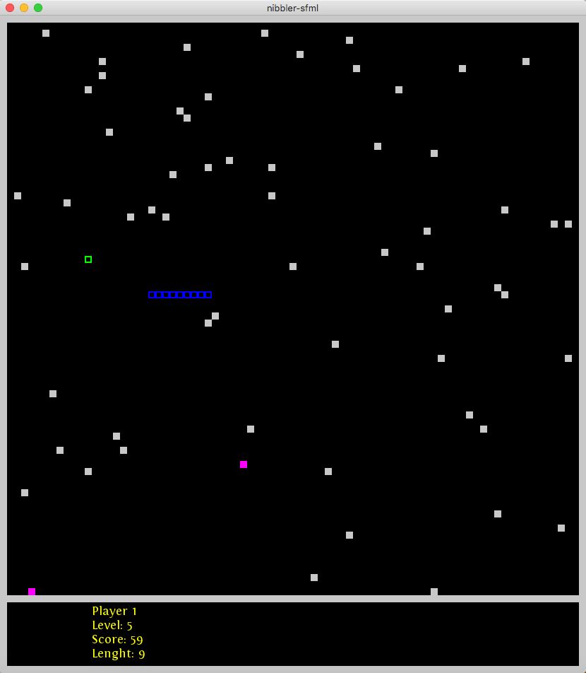

# Nibbler - 42/Unit Factory

2D game "SNAKE" with dynamic switching of 3 graphic libraries during pause.

# Authors:
- vholovin
- vsydorch

# Features:
- C++ + Dynamic Libraries
- ncurses + SDL + SFML
- auto downloader and auto installer for graphics libraries with Makefile's command "make"

# This project work only MacOS system
- Use "make" to compile program in terminal
- run ./nibbler

# Game features:
- scoring system
- random walls
- The speed of a game depends to the level of the player
- a bonus that suddenly appears and disappears
- multiplayers for 2 players
- In multiplayers, the speed of a game depends to the highest level from two players
- In multiplayers, each player has his own speed of movement wich depends to his level

# Controls:
- '`esc`' - pause
- '`enter`' - to choose

# Movement 1st player's:
- '`up`' - up
- '`down`' - down
- '`left`' - left
- '`right`' - righ

# Movement 2st player's:
- '`W`' - up
- '`S`' - down
- '`A`' - left
- '`D`' - right

# Render flags:
- '`1`' - ncurses
- '`2`' - sdl
- '`3`' - sfml
